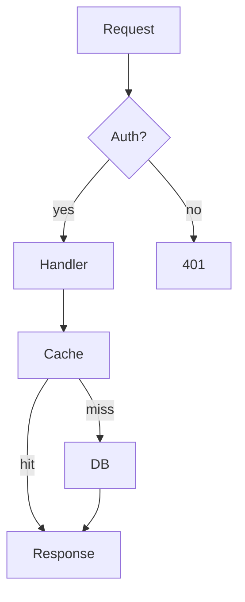
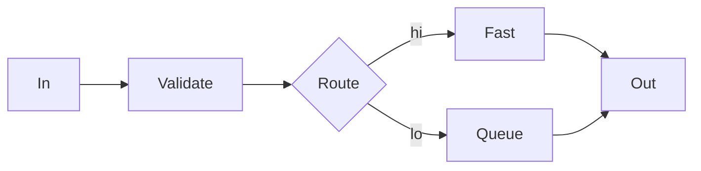
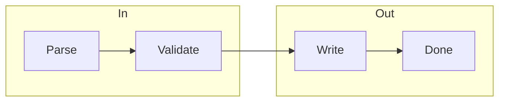
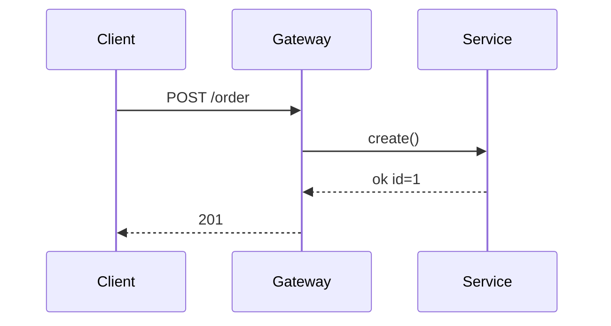
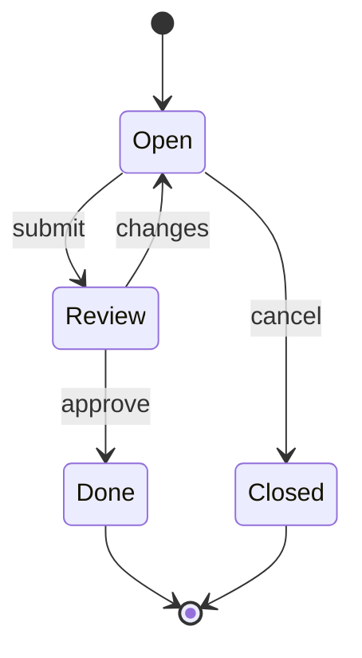
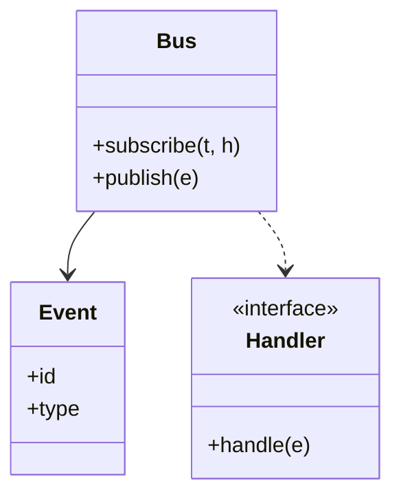
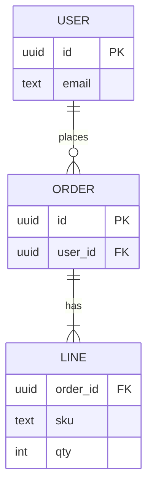
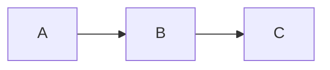

# Mermaid Diagrams

bmd renders fenced `mermaid` code blocks as ASCII/Unicode art inline in the terminal — no browser, no DOM, no external renderer required.

## Quick Start

```sh
printf '```mermaid\ngraph LR\n    A --> B --> C\n```' | bmd -
```

Output:

```
┌───┐  ┌───┐  ┌───┐
│   │  │   │  │   │
│ A ├─►│ B ├─►│ C │
│   │  │   │  │   │
└───┘  └───┘  └───┘
```

## Supported Diagram Types

| Type      | Keyword       | Description                         |
| --------- | ------------- | ----------------------------------- |
| Flowchart | `graph`, `flowchart` | Directed graphs with nodes and edges |
| Sequence  | `sequenceDiagram`    | Actor-to-actor message flows        |
| State     | `stateDiagram`       | State machines with transitions     |
| Class     | `classDiagram`       | UML class diagrams                  |
| ER        | `erDiagram`          | Entity-relationship diagrams        |

## Sample Diagrams

One compact example per supported type, plus a **subgraph** flowchart (grouped nodes).

### Flowchart (Top-Down)



### Flowchart (Left-Right)



### Flowchart (subgraphs)

`subgraph` groups nodes; edges can cross group boundaries.



### Sequence Diagram



### State Diagram



### Class Diagram



### ER Diagram



## Unsupported Diagram Types

Diagram types not listed above (gantt, pie, journey, etc.) render a labeled placeholder:

```
[mermaid: gantt — unsupported diagram type]
```

The placeholder identifies the type so you know what's missing. It does not break rendering of the rest of the document.

## Inline Mermaid

Semicolons act as line separators when the opening fence and body are on a single line:

```sh
echo '```mermaid;graph LR; A --> B; B --> C```' | bmd -
```

This is equivalent to:

````markdown

````

Useful for one-liner diagrams in shell scripts or inline documentation.

## Output Modes

| Mode            | Behavior                                           |
| --------------- | -------------------------------------------------- |
| UTF-8 + ANSI    | Box-drawing characters with theme-controlled color |
| UTF-8 no ANSI   | Box-drawing characters, no color                   |
| ASCII (`-a`)    | Plain ASCII art                                    |

## Error Handling

Syntax errors in a mermaid block produce a visible error message in the output but do not affect rendering of the rest of the document. Each block is parsed independently.

## Theming

Mermaid diagram colors are controlled by the `mer` theme facet:

```sh
bmd --theme "mer:dracula" README.md
```

Bundled themes: `dark`, `light`, `dracula`. See [themes.md](themes.md) for custom theme creation.

## Browser Preview

In `bmd serve`, mermaid blocks render as text art in the preview pane, matching terminal output. The same rendering engine is used for both terminal and browser.
