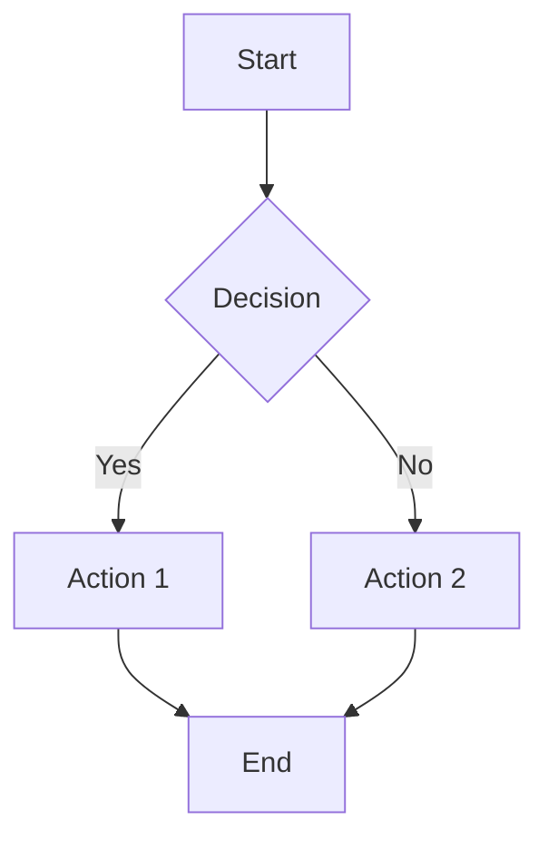

# Full Features Test

## Headings

### Third-Level Heading

#### Fourth-Level Heading

## Inline Formatting

This paragraph has **bold text**, *italic text*, ***bold italic***, `inline code`, ~~strikethrough~~, and a [link](https://example.com).

## Lists

### Tight Unordered List

- Apple
- Banana
- Cherry

### Loose Unordered List

- First item with some detail.

- Second item with some detail.

- Third item with some detail.

### Ordered List

1. Step one
2. Step two
3. Step three

### Nested Lists

- Top level
  - Second level
    - Third level
  - Back to second
- Back to top

## Blockquotes

> This is a simple blockquote.
>
> It has multiple paragraphs.

> > And this is a nested blockquote.

## Tables

| Feature       | Status    | Notes             |
|:--------------|:---------:|------------------:|
| Terminal      | Working   | ANSI colors       |
| Browser       | Working   | HTML + CSS        |
| Editor        | Working   | Tiptap decorations|

## Fenced Code Blocks

```javascript
function greet(name) {
  console.log(`Hello, ${name}!`);
  return true;
}
```

```python
def fibonacci(n):
    if n <= 1:
        return n
    return fibonacci(n - 1) + fibonacci(n - 2)
```

## Mermaid Diagram



## Horizontal Rule

---

## Images


## Invisible Unicode Characters

zero​width space here
word⁠joiner here
left‮to‬right override here
en space here
nbsp between words here
